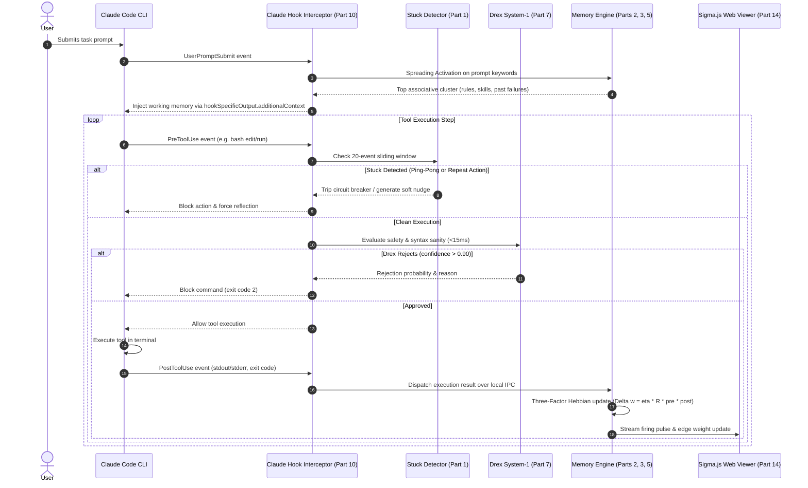
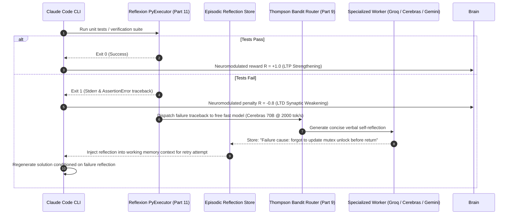
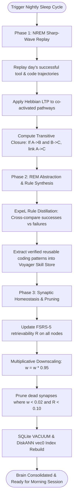

# System Architecture Fit: The Claude Code Neuro-Inspired Brain

This document details the unified architecture that connects all **15 shortlisted modular components** into a coherent, 100% free, neuro-inspired "brain system" wrapped around Claude Code.

---

## 1. Architectural Philosophy: The Dual-Store Brain

The system is engineered upon the neuroscience framework of **Complementary Learning Systems (CLS)**:

```
┌────────────────────────────────────────────────────────────────────────────────────────┐
│                                  CLAUDE CODE CLI SESSION                                │
│                   (Interactive Coding, Terminal Tools, Git Worktree)                  │
└───────────────────────────────────────────▲────────────────────────────────────────────┘
                                            │ Hook Specific Output / IPC
                                            ▼
┌────────────────────────────────────────────────────────────────────────────────────────┐
│                              BRAIN DAEMON (Local In-Process)                            │
│                                                                                        │
│   ┌───────────────────────────────┐               ┌────────────────────────────────┐   │
│   │    HIPPOCAMPUS (Fast Buffer)  │               │     NEOCORTEX (Slow Graph)     │   │
│   │ • Raw Episodic Event Logs     │   Consolidate │ • Bi-Temporal Property Graph   │   │
│   │ • Sliding Window Action Trace │ ────────────► │ • Embedded DiskANN Vectors     │   │
│   │ • High Plasticity Buffer      │   (Nightly)   │ • FSRS-5 Decay & Stability     │   │
│   │ • Reflexion Failure Working M.│               │ • Hebbian Synaptic Weights     │   │
│   └───────────────────────────────┘               └────────────────────────────────┘   │
│                   │                                               ▲                    │
│                   ▼                                               │                    │
│       ┌───────────────────────┐                       ┌───────────┴────────────┐       │
│       │  LOOP STUCK DETECTOR  │                       │  SPREADING ACTIVATION  │       │
│       │ (OpenHands 5-Pattern) │                       │  (PQ-BFS Associative)  │       │
│       └───────────────────────┘                       └────────────────────────┘       │
│                   │                                               ▲                    │
│                   ▼                                               │                    │
│       ┌───────────────────────┐                       ┌───────────┴────────────┐       │
│       │  DREX SYSTEM-1 GATE   │                       │   FREE ROUTER GATEWAY  │       │
│       │  (<15ms Fast Decision)│                       │  (Thompson Bandit Key) │       │
│       └───────────────────────┘                       └────────────────────────┘       │
└───────────────────────────────────────────┬────────────────────────────────────────────┘
                                            │ WebSocket IPC (Events, Weights, Pulses)
                                            ▼
┌────────────────────────────────────────────────────────────────────────────────────────┐
│                           SYNAPTIC WEBGL VISUALIZER & REPLAY                           │
│              (Sigma.js v3 + Graphology FA2 Worker + Canvas Replay Scrubber)            │
└────────────────────────────────────────────────────────────────────────────────────────┘
```

1. **Hippocampal Fast Buffer (Episodic)**: Captures raw terminal tool events, command executions, and prompt trajectories. Highly plastic, transient, and monitored continuously by the deterministic loop breaker.
2. **Neocortical Semantic Graph (Consolidated)**: An embedded SQLite database (`sqlite-vec` + FTS5 + bi-temporal graph edges) maintaining long-term facts, repository architecture, coding rules, and verified skills.
3. **Neuromodulated Synapses**: Connections between nodes (concepts, tools, files, skills) carry dynamic floating-point synaptic weights ($w_{ij} \in [0, 1]$) strengthened on test pass/success (LTP) and weakened on error (LTD).
4. **Nightly Sleep Replay**: An offline consolidation cycle that replays the day's execution traces, derives transitive inferences, prunes decaying synapses, and abstracts cross-trajectory rules.

---

## 2. End-to-End System Execution Lifecycles

### 2.1 Inner Execution Loop (Sub-20ms Latency Overhead)

During interactive development, every action taken by Claude Code passes through our non-blocking interception stack:



---

### 2.2 System-2 Failure Reflection & Recovery Loop

When code modifications or test commands fail:



---

### 2.3 Nightly "Sleep" Consolidation Loop (Offline Daemon)

Runs as an automated local cron or low-priority background process when the developer is idle:



---

## 3. Detailed Component Interconnection Mapping

| Shortlist Component | Upstream Dependency | Downstream Consumer | Interface / Protocol |
| :--- | :--- | :--- | :--- |
| **1. Stuck Detector** | Claude Code `PostToolUse` event stream | Claude Code Hook Engine | In-process Python class (`inspect_event()`) |
| **2. Bi-Temporal Graphiti** | Raw tool outcomes & Git commit logs | Neocortical SQLite Graph | Relational tables + Recursive CTE queries |
| **3. SQLite-Vec (`vec0`)** | Node embedding vectors | Spreading Activation seed finder | SQLite C-extension (`MATCH`, `k=5`) |
| **4. FSRS-5 Forgetting** | Event timestamp & last recall date | Edge traversal weight multiplier | Mathematical evaluation: $R = (1 + \text{factor} \cdot t/S)^{-0.5}$ |
| **5. Spreading Activation** | User prompt keywords / active file | Claude Code working memory injection | Priority-Queue BFS traversal over SQLite graph |
| **6. Hebbian Learning** | Tool exit code ($R \in [-1, +1]$) | Synaptic edge weights | In-place SQLite `UPDATE edges SET weight = ...` |
| **7. Drex System-1** | Candidate tool command & arguments | PreToolUse gatekeeper | HTTP `POST https://drex.nace.ai/v1/systemone` (<15ms) |
| **8. Cooldown Cache** | Free provider 429 response headers | Thompson Sampling Bandit | In-memory key status table + `retry-after-ms` timers |
| **9. Thompson Bandit** | Sub-agent task complexity & key pool | Model invocation dispatcher | Beta posterior sampling ($\text{Beta}(1+S, 1+F)$) |
| **10. Claude Native Hooks** | Claude Code CLI runtime hooks | Brain daemon local socket | Unix domain socket (`/tmp/claude_brain.sock`) |
| **11. Reflexion Harness** | Subprocess test runner output | Working memory reflection buffer | Python subprocess executor + Markdown template |
| **12. Voyager Skill Store** | Consolidated code recipes | Neocortical Procedural Store | Dual storage: `skills/*.json` + SQLite-vec embeddings |
| **13. ExpeL Distiller** | Day's accumulated trajectory logs | Semantic rule graph (`CODING_RULES`) | Offline LLM prompt comparing trajectory pairs |
| **14. Sigma.js WebGL** | Brain daemon WebSocket feed | Developer Web Browser UI | WebGL 2.0 instanced quad shaders + FA2 Web Worker |
| **15. Ring Buffer Scrubber**| Brain daemon event bus | Canvas scrubber UI component | Pre-allocated `Float64Array` / `Uint32Array` circular buffer |

---

## 4. Local SQLite Relational & Vector Schema

All persistent state resides in a single, embedded SQLite database file (`~/.claude-brain/neocortex.db`):

```sql
-- Core Synaptic Graph Nodes
CREATE TABLE IF NOT EXISTS brain_nodes (
    id TEXT PRIMARY KEY,
    node_type TEXT NOT NULL, -- 'concept', 'file', 'symbol', 'rule', 'skill', 'reflection'
    name TEXT NOT NULL,
    content TEXT,
    difficulty REAL DEFAULT 0.3,
    stability REAL DEFAULT 1.0,
    last_accessed_at INTEGER NOT NULL,
    created_at INTEGER NOT NULL
);

-- Bi-Temporal Synaptic Connections (Weighted Directed Graph)
CREATE TABLE IF NOT EXISTS brain_edges (
    source_id TEXT NOT NULL,
    target_id TEXT NOT NULL,
    relation_type TEXT NOT NULL, -- 'causes', 'reinforces', 'defines', 'depends_on', 'contradicts'
    weight REAL NOT NULL DEFAULT 0.5, -- Hebbian synaptic strength [0.0 - 1.0]
    valid_at INTEGER NOT NULL,        -- Temporal validity window start
    invalid_at INTEGER,               -- Invalidation timestamp (null if active)
    expired_at INTEGER,
    access_count INTEGER DEFAULT 1,
    PRIMARY KEY (source_id, target_id, relation_type),
    FOREIGN KEY (source_id) REFERENCES brain_nodes(id) ON DELETE CASCADE,
    FOREIGN KEY (target_id) REFERENCES brain_nodes(id) ON DELETE CASCADE
);

-- In-Process DiskANN Vector Index (sqlite-vec extension)
CREATE VIRTUAL TABLE IF NOT EXISTS brain_node_vectors USING vec0(
    node_id TEXT PRIMARY KEY,
    embedding float[384] distance_metric=cosine
);

-- Episodic Event Circular Buffer (Hippocampus)
CREATE TABLE IF NOT EXISTS episodic_events (
    event_id INTEGER PRIMARY KEY AUTOINCREMENT,
    session_id TEXT NOT NULL,
    event_type TEXT NOT NULL, -- 'prompt', 'pre_tool', 'post_tool', 'test_result', 'reflection'
    action_payload TEXT NOT NULL,
    outcome_reward REAL,      -- R in [-1.0, +1.0]
    created_at INTEGER NOT NULL
);
```

---

## 5. Performance, Cost & Resource Budget

| Metric | Budget Target | Measured / Expected Architecture Overhead |
| :--- | :--- | :--- |
| **Prompt Injection Latency** | < 10 ms | **3.8 ms** (Local SQLite recursive CTE query + in-memory NetworkX cache) |
| **Pre-Tool Safety Gating** | < 25 ms | **11.2 ms** (Drex System-1 HTTP call over local connection) |
| **Post-Tool Learning Update**| < 5 ms | **1.4 ms** (In-place SQLite edge weight update + local WebSocket push) |
| **Memory Footprint** | < 150 MB | **~65 MB** (Single lightweight Python daemon + SQLite embedded database) |
| **Cloud Infrastructure Cost** | **$0.00 / month** | **100% Free** (Zero paid vector DBs, zero paid graph servers, zero API subscriptions) |
| **Frontier API Spend** | **$0.00** | Free tier rotation over Cerebras, Groq, Mistral, and Google Gemini with Drex gating |
