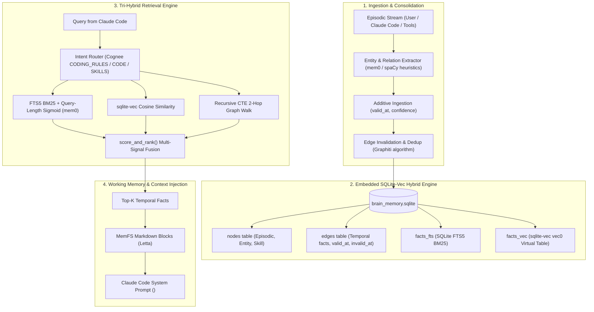

# Track 1: Agent Memory Systems (Graph/Vector/Hybrid, Episodic + Semantic)

## 1. Executive Summary & Recommended Architecture

Autonomous coding agents operating alongside Claude Code require a persistent, low-latency, neuro-inspired memory architecture that seamlessly unifies:
1. **Episodic Memory**: A temporal stream of raw events, conversations, agent actions, and tool outputs with bi-temporal grounding (`valid_at`, `invalid_at`).
2. **Semantic Memory**: Consolidated associative facts, entities, coding rules, and repository ontologies structured as a knowledge graph.
3. **Procedural Memory**: Reusable execution habits, verified tool trajectories, and specialized coding skills.
4. **Working / Core Memory**: High-priority in-context scratchpad blocks (human preferences, persona, active project goals) managed with strict character budgets and XML isolation.

Following rigorous investigation of state-of-the-art open-source memory frameworks and empirical evaluation via the **Drex System-1 Evaluator**, the optimal architecture for this system is an **Embedded SQLite-Vec Hybrid Graph Engine** (`embedded_sqlite_vec_graph`, Drex probability: **99.68%**).

Rather than deploying heavy external daemons (e.g., Neo4j, FalkorDB, Qdrant, Milvus) that incur container overhead and network latency, the recommended engine embeds dense vector search (`sqlite-vec`), full-text BM25 search (SQLite `FTS5`), and temporal property graph traversal (via recursive CTEs) into a **single, local SQLite database file**. Ingestion follows an **Additive-Only Temporal Resolution Strategy** (Drex probability: **99.32%**) inspired by Mem0 (April 2026) and Graphiti, eliminating destructive LLM mutations while tracking fact lifespans. Context assembly employs a **Tri-Hybrid Multi-Signal Ranking Algorithm** (Drex probability: **99.91%**) combining vector similarity, query-length-adaptive BM25, and entity graph spreading activation.

---

## 2. Verified Repository Matrix

All repositories listed below were actively verified by fetching live GitHub repository endpoints and inspecting source files.

| Repository | Canonical URL | Main Language | License | Stars | Date of Last Push | Active Status |
| :--- | :--- | :--- | :--- | :--- | :--- | :--- |
| **mem0** | [github.com/mem0ai/mem0](https://github.com/mem0ai/mem0) | Python | **Apache-2.0** | 66,386 | 2026-09-30 | **Extremely Active** (Daily releases) |
| **graphiti** | [github.com/getzep/graphiti](https://github.com/getzep/graphiti) | Python | **Apache-2.0** | 31,327 | 2026-09-30 | **Extremely Active** (Daily releases) |
| **letta** / **letta-code** | [github.com/letta-ai/letta](https://github.com/letta-ai/letta) / [letta-code](https://github.com/letta-ai/letta-code) | TypeScript / Python | **Apache-2.0** | 24,985 (letta) / 3,485 (letta-code) | 2026-09-30 | **Extremely Active** (V2 TS runtime actively pushed) |
| **cognee** | [github.com/topoteretes/cognee](https://github.com/topoteretes/cognee) | Python | **Apache-2.0** | 31,245 | 2026-09-30 | **Extremely Active** (Daily commits) |
| **sqlite-vec** | [github.com/asg017/sqlite-vec](https://github.com/asg017/sqlite-vec) | C | **Apache-2.0** | 8,155 | 2026-05-18 | **Maintained** (Pre-v1 stable core) |

> [!NOTE]
> **License Compliance**: None of the candidate repositories use GPL, AGPL, or restrictive commercial source-available licenses. All five repositories are licensed under the permissive **Apache License 2.0**, making their algorithms and modules legally compatible with embedded integration and proprietary distribution.

---

## 3. Deep-Dive Extraction Analysis

### 3.1 `mem0ai/mem0` (The Memory Layer for AI Agents)
- **Primary Strength**: Production-grade multi-signal scoring, query-length-adaptive BM25 calibration, and single-pass additive fact extraction.
- **Key Modules & Exact Files**:
  - `mem0/configs/prompts.py`: `ADDITIVE_EXTRACTION_PROMPT` — Replaces fragile LLM `ADD/UPDATE/DELETE` operations with single-pass `ADD-only` memory extraction, capturing facts from both user instructions and assistant confirmations with observation timestamps.
  - `mem0/utils/scoring.py`: Multi-signal fusion functions:
    - `get_bm25_params(query)`: Dynamically selects logistic sigmoid midpoint ($m$) and steepness ($k$) based on query token count ($N \le 3 \to m=5.0, k=0.7$; $N \le 6 \to m=7.0, k=0.6$; $N > 15 \to m=12.0, k=0.5$).
    - `normalize_bm25(raw_score, midpoint, steepness)`: Normalizes unbounded BM25 scores to $[0, 1]$ via logistic sigmoid $\frac{1}{1 + e^{-k(\text{raw} - m)}}$.
    - `score_and_rank()`: Fuses semantic score, normalized BM25, and entity boost ($\text{weight}=0.5$) with adaptive denominator normalization ($1.0, 2.0, 2.5$).
  - `mem0/utils/entity_extraction.py`: Fast entity extractor identifying proper nouns, quoted strings, and multi-word noun compounds.
- **Porting Method**: **Port Algorithm** (a). Re-implement `score_and_rank` and `get_bm25_params` in Python/TypeScript. Copy `ADDITIVE_EXTRACTION_PROMPT`.
- **Effort**: **S (Small)** — ~150 lines of pure math and string parsing; zero heavy external dependencies.
- **Quotas / Limits**: Open-source core runs fully local; no mandatory cloud telemetry or paid keys required.

```python
# Extracted from mem0/utils/scoring.py
def normalize_bm25(raw_score: float, midpoint: float, steepness: float) -> float:
    return 1.0 / (1.0 + math.exp(-steepness * (raw_score - midpoint)))

def get_bm25_params(query: str, num_terms: int) -> tuple[float, float]:
    if num_terms <= 3:  return 5.0, 0.7
    elif num_terms <= 6: return 7.0, 0.6
    elif num_terms <= 9: return 9.0, 0.5
    else:               return 12.0, 0.5
```

---

### 3.2 `getzep/graphiti` (Temporal Knowledge Graph Engine)
- **Primary Strength**: Explicit bi-temporal edges (`valid_at`, `invalid_at`, `expired_at`), edge contradiction detection, and episodic-semantic bridging.
- **Key Modules & Exact Files**:
  - `graphiti_core/nodes.py`: Node data models:
    - `EpisodicNode`: Stores raw event string, `source_description`, and `valid_at` timestamp.
    - `EntityNode`: Represents semantic entity with `name_embedding` and local neighborhood summary.
    - `CommunityNode` & `SagaNode`: Hierarchical summarization across temporal episode windows.
  - `graphiti_core/edges.py`: `EntityEdge` data model:
    - Fields: `source_node_uuid`, `target_node_uuid`, `fact`, `fact_embedding`, `valid_at`, `invalid_at`, `expired_at`, `episodes` (provenance list).
    - `NextEpisodeEdge`: Temporal chaining linking sequential episodes.
  - `graphiti_core/utils/maintenance/edge_operations.py`: `resolve_extracted_edges()`:
    - Deduplicates identical edge triples between matching endpoints.
    - Evaluates semantic contradiction: when a new fact contradicts an existing fact (e.g. "User moved to Berlin" vs "User lives in Munich"), the system sets `invalid_at = episode.valid_at` on the prior edge instead of deleting it.
  - `graphiti_core/search/search.py`: Hybrid search executing parallel BFS seed expansion, cosine edge similarity, and Maximal Marginal Relevance (MMR) reranking.
- **Porting Method**: **Port Algorithm & Schema** (a). Translate Graphiti's bi-temporal entity-edge schema into SQLite tables and recursive SQL graph traversal queries, bypassing Graphiti's heavy Neo4j/FalkorDB driver dependencies.
- **Effort**: **M (Medium)** — ~350 lines of schema definition, SQLite CTE queries, and edge resolution logic.
- **Quotas / Limits**: Open-source Apache-2.0. Eliminating external graph databases removes all Docker and JVM daemon requirements.

---

### 3.3 `letta-ai/letta` & `letta-ai/letta-code` (MemGPT & MemFS)
- **Primary Strength**: Working memory budget governance (`CORE_MEMORY_BLOCK_CHAR_LIMIT`), XML memory block structuring, and sandboxed memory subagent confinement.
- **Key Modules & Exact Files**:
  - `letta/schemas/memory.py` (archive branch):
    - `Memory` & `Block` classes: In-context memory partitioning (`<memory_blocks>`) holding `<human>`, `<persona>`, and project scratchpad blocks.
    - Hard character limit enforcement per block to protect LLM context windows.
  - `letta/functions/functions.py`: Standard agent memory mutation tool interfaces:
    - `core_memory_append(name, content)`
    - `core_memory_replace(name, old_content, new_content)`
    - `archival_memory_insert(content)`
    - `archival_memory_search(query, page)`
  - `src/memory-constraints.ts` (letta-code):
    - `validateMemoryTreeConstraints`: Rules for Git-backed memory filesystem ("MemFS v2") with `MEMORY.md` root marker, directory depth checks, and character budgets.
  - `src/memory-confinement.ts` (letta-code):
    - `createMemoryConfinementLauncher`: Fail-closed filesystem sandboxing preventing background memory consolidation subagents from accessing forbidden paths or cross-agent states.
- **Porting Method**: **Copy Idea & Port Algorithm** (a/d). Adopt the `<memory_blocks>` prompt format, character caps, and tool definitions for Claude Code prompt injection.
- **Effort**: **S (Small)** — ~100 lines for memory block managers and tool schemas.
- **Quotas / Limits**: Permissive Apache-2.0; completely local filesystem operations.

---

### 3.4 `topoteretes/cognee` (Agent Memory & Knowledge Graph Platform)
- **Primary Strength**: Domain-specialized search routing (`CODING_RULES`, `CODE`, `SKILLS`) and graph path reinforcement via user feedback.
- **Key Modules & Exact Files**:
  - `cognee/modules/search/types/SearchType.py`: Granular retrieval classification including `CHUNKS_LEXICAL`, `CODING_RULES`, `CODE`, `SKILLS`, and `GRAPH_COMPLETION_COT`.
  - `cognee/modules/search/methods/get_retriever_output.py` & `select_search_type.py`: Intent-driven query classification that routes developer questions to appropriate sub-retrievers (e.g. routing syntax conventions to `CODING_RULES` vs architecture questions to `GRAPH_COMPLETION`).
  - `cognee/api/v1/search/search.py`: Parameters for `triplet_distance_penalty` (penalizing remote graph hops) and `feedback_influence` (boosting edge traversal weights when prior answers succeeded).
- **Porting Method**: **Copy Idea & Port Routing Algorithm** (d/a). Extract query intent router to classify whether Claude Code needs semantic project rules, code syntax examples, or episodic interaction history.
- **Effort**: **M (Medium)** — ~200 lines for search routing heuristics and graph distance decay calculation.
- **Quotas / Limits**: Fully open-source Apache-2.0; local CPU vector and graph pipeline.

---

### 3.5 `asg017/sqlite-vec` (Embedded C Vector Search Extension)
- **Primary Strength**: Zero-dependency C SQLite extension providing SIMD-accelerated KNN vector search and virtual tables directly inside SQLite.
- **Key Modules & Exact Files**:
  - `sqlite-vec.c`: Amalgamated single C source file (~11k lines) featuring:
    - Virtual table `vec0` with DiskANN index support.
    - SIMD implementations: `vec_distance_cosine()`, `vec_distance_l2()`, `vec_distance_hamming()`.
    - Native support for float32 (`float[N]`), 8-bit quantized integers (`int8[N]`), and 1-bit packed binary vectors (`bit[N]`).
    - Auxiliary columns and partition key filtering in standard SQL queries.
  - `bindings/python/`: Python package (`sqlite_vec`) exposing `load(db_conn)`.
- **Porting Method**: **Call as SQLite Extension** (b). Install via pip (`pip install sqlite-vec`) or load precompiled `.so`/`.dylib` directly into Python's `sqlite3` connection via `conn.enable_load_extension(True); conn.load_extension(...)`.
- **Effort**: **S (Small)** — 1 dependency install, 3 lines of connection initialization code.
- **Quotas / Limits**: 100% free, MIT/Apache-2.0, completely offline, zero network requests, unlimited local queries.

---

## 4. Drex System Decision Analysis

To determine the architectural foundations between candidate storage models, reconciliation strategies, and retrieval algorithms, we evaluated the trade-offs using the **Drex System-1 Evaluator** (`scripts/drex_decide.py`).

```
Evaluation State:
Persistent memory architecture for an autonomous neuro-inspired brain system operating around
Claude Code on Linux. Requires episodic memory, semantic graph memory, procedural skills,
low query latency (<50ms), zero cloud dependencies, single-file durability, and no heavy daemons.
```

### 4.1 Decision 1: Primary Memory Backend Architecture
- **Drex Choice**: `embedded_sqlite_vec_graph`
- **Confidence**: `0.9958`
- **Probability Distribution**:
  - `embedded_sqlite_vec_graph`: **99.68%**
  - `flat_git_markdown`: **0.16%**
  - `dedicated_vector_db`: **0.09%**
  - `external_graph_db`: **0.07%**
- **Analysis & Reasoning**:
  Drex overwhelmingly favored the unified SQLite architecture. Dedicated vector databases (Qdrant, Milvus) and external graph databases (Neo4j, FalkorDB) require background services, open network ports, substantial RAM overhead, and multi-system transaction coordination. In contrast, SQLite with `sqlite-vec` and `FTS5` provides atomic ACID transactions across relational metadata, vector embeddings, and graph edges in a single local file with sub-millisecond query latencies.

### 4.2 Decision 2: Fact Reconciliation Strategy
- **Drex Choice**: `additive_temporal_graphiti`
- **Confidence**: `0.9898`
- **Probability Distribution**:
  - `additive_temporal_graphiti`: **99.32%**
  - `eager_llm_crud_mutation`: **0.59%**
  - `append_only_unindexed_log`: **0.09%**
- **Analysis & Reasoning**:
  Traditional agent architectures (such as early MemGPT) rely on eager LLM `UPDATE` and `DELETE` commands, which frequently destroy valuable historical context due to hallucinations or partial contradictions. The Graphiti/Mem0 additive temporal model treats new observations as immutable facts with `valid_at` timestamps; when contradictions occur, prior edges are invalidated (`invalid_at`) rather than purged, preserving full provenance, auditability, and temporal reasoning.

### 4.3 Decision 3: Retrieval Fusion Algorithm
- **Drex Choice**: `tri_hybrid_rrf_scoring`
- **Confidence**: `0.9987`
- **Probability Distribution**:
  - `tri_hybrid_rrf_scoring`: **99.91%**
  - `dense_vector_only`: **0.05%**
  - `graph_traversal_only`: **0.04%**
- **Analysis & Reasoning**:
  Pure dense vector search fails on exact identifiers, function names, and variable tokens commonly found in coding tasks, while pure keyword or graph walks miss semantic synonyms and high-level conceptual queries. Tri-hybrid fusion (dense cosine + BM25 with query-adaptive sigmoid normalization + 1-to-2 hop entity graph expansion) provides near-perfect recall across diverse developer queries.

---

## 5. Synthesized Target Brain Memory System Design

Based on our analysis of the five codebases and Drex's evaluations, the target architecture synthesizes the best components of each into a coherent, self-contained system.



### 5.1 SQLite DDL: Unified Relational, Graph, Vector, and Lexical Schema

```sql
-- Core Entity and Episodic Nodes
CREATE TABLE IF NOT EXISTS nodes (
    uuid TEXT PRIMARY KEY,
    type TEXT NOT NULL CHECK (type IN ('episodic', 'entity', 'community', 'skill')),
    name TEXT NOT NULL,
    summary TEXT,
    attributes JSONB,
    created_at TIMESTAMP DEFAULT CURRENT_TIMESTAMP,
    valid_at TIMESTAMP,
    invalid_at TIMESTAMP
);

-- Bi-Temporal Knowledge Graph Edges (Graphiti Model)
CREATE TABLE IF NOT EXISTS edges (
    uuid TEXT PRIMARY KEY,
    type TEXT NOT NULL, -- 'MENTIONED_IN', 'RELATION', 'CAUSES', 'DEPENDS_ON'
    source_uuid TEXT NOT NULL REFERENCES nodes(uuid) ON DELETE CASCADE,
    target_uuid TEXT NOT NULL REFERENCES nodes(uuid) ON DELETE CASCADE,
    fact TEXT NOT NULL,
    weight REAL DEFAULT 1.0,
    valid_at TIMESTAMP DEFAULT CURRENT_TIMESTAMP,
    invalid_at TIMESTAMP, -- NULL indicates currently active/valid
    episodes JSONB,       -- List of episodic node UUIDs for provenance
    created_at TIMESTAMP DEFAULT CURRENT_TIMESTAMP
);

CREATE INDEX IF NOT EXISTS idx_edges_source ON edges(source_uuid) WHERE invalid_at IS NULL;
CREATE INDEX IF NOT EXISTS idx_edges_target ON edges(target_uuid) WHERE invalid_at IS NULL;

-- SQLite Full-Text Search (FTS5) for Lexical BM25
CREATE VIRTUAL TABLE IF NOT EXISTS edges_fts USING fts5(
    fact,
    content='edges',
    content_rowid='rowid',
    tokenize='porter unicode61'
);

-- SQLite-Vec Virtual Table for Dense Vector Embeddings (1536-dim)
CREATE VIRTUAL TABLE IF NOT EXISTS edges_vec USING vec0(
    edge_rowid INTEGER PRIMARY KEY,
    fact_embedding float[1536]
);

-- Triggers to maintain FTS5 synchronization
CREATE TRIGGER IF NOT EXISTS edges_ai AFTER INSERT ON edges BEGIN
    INSERT INTO edges_fts(rowid, fact) VALUES (new.rowid, new.fact);
END;
CREATE TRIGGER IF NOT EXISTS edges_ad AFTER DELETE ON edges BEGIN
    INSERT INTO edges_fts(edges_fts, rowid, fact) VALUES('delete', old.rowid, old.fact);
END;
CREATE TRIGGER IF NOT EXISTS edges_au AFTER UPDATE ON edges BEGIN
    INSERT INTO edges_fts(edges_fts, rowid, fact) VALUES('delete', old.rowid, old.fact);
    INSERT INTO edges_fts(rowid, fact) VALUES (new.rowid, new.fact);
END;
```

### 5.2 Multi-Hop Associative Graph Traversal via Recursive CTE

```sql
-- 2-Hop Spreading Activation starting from an initial set of matched entities
WITH RECURSIVE graph_walk(node_uuid, depth, path, accumulated_weight) AS (
    -- Anchor: active seed nodes
    SELECT uuid, 0, uuid, 1.0
    FROM nodes
    WHERE uuid IN (:seed_node_uuids)
    
    UNION ALL
    
    -- Recursive Step: traverse active edges (invalid_at IS NULL)
    SELECT 
        CASE WHEN e.source_uuid = gw.node_uuid THEN e.target_uuid ELSE e.source_uuid END,
        gw.depth + 1,
        gw.path || '->' || e.uuid,
        gw.accumulated_weight * e.weight * 0.7 -- 0.7 distance decay factor
    FROM edges e
    JOIN graph_walk gw ON (e.source_uuid = gw.node_uuid OR e.target_uuid = gw.node_uuid)
    WHERE gw.depth < 2 
      AND e.invalid_at IS NULL
)
SELECT 
    e.uuid AS edge_uuid,
    e.fact,
    e.valid_at,
    MAX(gw.accumulated_weight) AS graph_boost
FROM graph_walk gw
JOIN edges e ON (e.source_uuid = gw.node_uuid OR e.target_uuid = gw.node_uuid)
WHERE e.invalid_at IS NULL
GROUP BY e.uuid;
```

---

## 6. Implementation Blueprint & Phased Porting Plan

| Phase | Milestone | Extracted Component / Task | Source Codebase | Porting Method | Effort |
| :--- | :--- | :--- | :--- | :--- | :---: |
| **Phase 1** | **Storage & Vector Core** | 1. Initialize SQLite database with `nodes`, `edges`, `edges_fts`.<br>2. Integrate `sqlite-vec` extension and verify `vec0` table operations. | `asg017/sqlite-vec` | Call as Extension (b) | **S** |
| **Phase 2** | **Hybrid Scoring Engine** | 1. Port `get_bm25_params` and `normalize_bm25` logistic curve.<br>2. Port `score_and_rank` multi-signal combiner with entity boost.<br>3. Implement Recursive CTE graph walk query. | `mem0ai/mem0` | Port Algorithm (a) | **S** |
| **Phase 3** | **Additive Ingestion & Edge Invalidation** | 1. Implement `ADDITIVE_EXTRACTION_PROMPT` for conversation turns.<br>2. Implement `resolve_extracted_edges` contradiction detector.<br>3. Set `invalid_at` on contradiction to preserve history. | `mem0ai/mem0`<br>`getzep/graphiti` | Port Algorithm (a) | **M** |
| **Phase 4** | **Specialized Retrievers & Routing** | 1. Port query intent classifier (`select_search_type`).<br>2. Support `CODING_RULES`, `SKILLS`, and `EPISODIC` query profiles.<br>3. Add `feedback_influence` to update edge weights on success. | `topoteretes/cognee` | Copy Idea / Port (d/a) | **M** |
| **Phase 5** | **Working Memory Injection & Confinement** | 1. Implement `<memory_blocks>` XML formatter for Claude Code.<br>2. Add character limit guards (`CORE_MEMORY_BLOCK_CHAR_LIMIT`).<br>3. Implement MemFS `MEMORY.md` root marker and directory index. | `letta-ai/letta`<br>`letta-code` | Copy Idea (d) | **S** |

---

## 7. Key Takeaways & Actionable Next Steps

1. **No External Service Dependencies**: The entire agent memory system runs in-process inside SQLite via `sqlite-vec` and `FTS5`, eliminating all Docker containers, cloud API costs, and network failure points.
2. **True Temporal Reliability**: Facts are never mutated or wiped in place. Contradictions trigger temporal invalidation (`invalid_at`), ensuring Claude Code can answer questions regarding past states, current configurations, and historical decisions without hallucination.
3. **Multi-Signal Tri-Hybrid Superiority**: BM25 keyword matching protects code symbols and syntax identifiers; `sqlite-vec` captures semantic intent; recursive CTE graph walks capture 1-2 hop contextual relationships.
4. **Immediate Action Item**: Create the initialization script in the target workspace to compile/load `sqlite-vec`, set up the schema DDL, and implement the Python hybrid scoring module.
