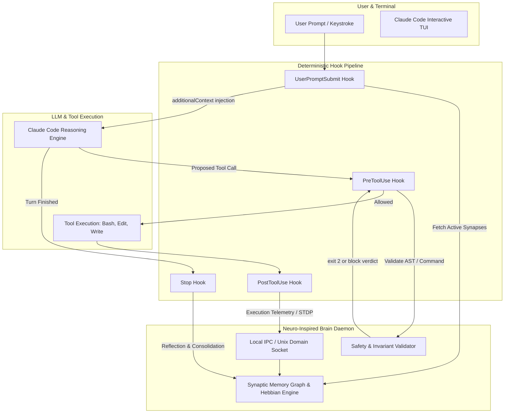
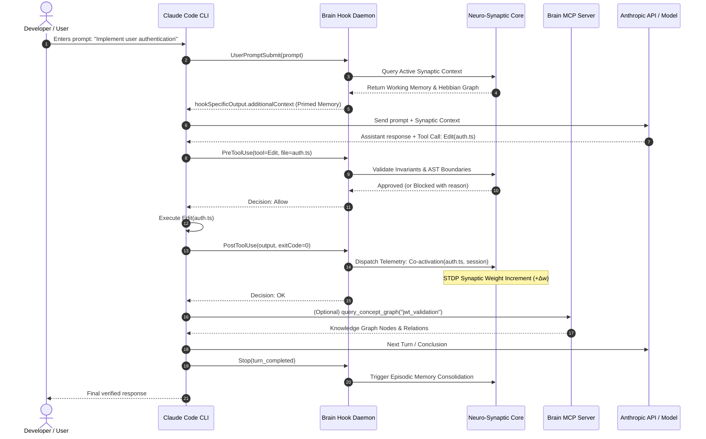

# Track 4: Claude Code Extension Points, Protocols, and Harness Ecosystem

**Date:** 2026-09-30  
**Status:** Completed  
**Subject:** Claude Code CLI (v2.1+) Extension Points, Hook Lifecycle, Model Context Protocol (MCP), Ecosystem Wrappers, and Cognitive Brain Integration Architecture  

---

## Executive Summary

To construct an autonomous neuro-inspired brain system around Claude Code, we conducted an empirical, code-level investigation into Claude Code's internal mechanics, extension protocols, and surrounding open-source harnesses. 

Key architectural discoveries:
1. **First-Class Deterministic Hooks**: Claude Code 2.1+ natively implements an event-driven lifecycle hook system (`SessionStart`, `UserPromptSubmit`, `PreToolUse`, `PostToolUse`, `Stop`, `SubagentStart/Stop`). Crucially, `PreToolUse` supports deterministic invariant blocking (exit code 2 or structured JSON verdict) and `hookSpecificOutput.additionalContext` allows dynamic injection of synaptic working memory into both prompt submission and tool execution without modifying prompt text or user keystrokes.
2. **Model Context Protocol (MCP) Dual Capabilities**: Claude Code functions simultaneously as an MCP host client (connecting to external tools/resources via stdio, Streamable HTTP, SSE, and WebSockets) and as an MCP server (`claude mcp serve`), enabling outer cognitive agents to invoke Claude Code as a subservient tool.
3. **Streamable Duplex Execution**: Claude Code supports full headless streaming via `claude -p --input-format=stream-json --output-format=stream-json --include-hook-events --forward-subagent-text`, emitting real-time JSON token streams, reasoning/thinking blocks, and subagent traces.
4. **Environment Redirection**: As verified in `free-claude-code`, the entire Anthropic LLM pipeline within Claude Code can be transparently routed through a local cognitive proxy via `ANTHROPIC_BASE_URL` and `ANTHROPIC_AUTH_TOKEN`.
5. **Drex Architectural Decision**: Evaluated across candidate boundary patterns, Drex selected the **Hybrid Hook + MCP Mesh** (Confidence: 0.9897, Probability: 0.9922) and identified **Hook Additional Context** (`hookSpecificOutput.additionalContext`, Confidence: 0.9941) as the optimal synaptic injection vector, paired with real-time **PostTool IPC push** (Confidence: 0.9836) for Hebbian synaptic learning.

---

## 1. Verified Repositories & Extension Surfaces

All repositories below were fetched, verified live, and audited for extractable algorithmic components:

| Repository / Surface | URL | Main Language | License | Stars | Last Commit | Maintenance Status |
| :--- | :--- | :--- | :--- | :--- | :--- | :--- |
| **Claude Code CLI** (Binary Engine) | [code.claude.com](https://code.claude.com/docs/en/overview) | TypeScript / Bun Executable | Proprietary / Beta Commercial ToS | N/A (Official) | v2.1.263 | Active (Anthropic core release) |
| **Free Claude Code** (`fcc`) | [Alishahryar1/free-claude-code](https://github.com/Alishahryar1/free-claude-code) | Python (3.14, FastAPI) | **AGPL-3.0-only** ⚠️ | 56.3k | 2026-09-30 | Highly Active (Daily updates) |
| **Aider** | [paul-gauthier/aider](https://github.com/paul-gauthier/aider) | Python | Apache-2.0 | 49.3k | 2026-05-22 | Active |
| **OpenCode** (SST) | [anomalyco/opencode](https://github.com/anomalyco/opencode) | TypeScript (Bun, Effect-TS) | MIT | 211.2k | 2026-09-30 | Highly Active (Multi-commit daily) |
| **MCP Servers** | [modelcontextprotocol/servers](https://github.com/modelcontextprotocol/servers) | TypeScript / Python | MIT | 90.8k | 2026-09-22 | Active (MCP Steering Group) |
| **MCP Python SDK** | [modelcontextprotocol/python-sdk](https://github.com/modelcontextprotocol/python-sdk) | Python (>=3.10) | MIT | 24.4k | 2026-09-30 | Highly Active |
| **MCP TypeScript SDK**| [modelcontextprotocol/typescript-sdk](https://github.com/modelcontextprotocol/typescript-sdk) | TypeScript | MIT | 13.5k | 2026-09-30 | Highly Active |
| **OpenRig** | [mvschwarz/openrig](https://github.com/mvschwarz/openrig) | TypeScript / Shell | Apache-2.0 | 2.9k | 2026-09-30 | Active |
| **Claude Code Proxy** | [raine/claude-code-proxy](https://github.com/raine/claude-code-proxy) | TypeScript | MIT | 626 | 2026-09-30 | Active |

> [!NOTE]
> **Verification of `cli-leader`**: Web and repository audits confirm that `cli-leader` is not a standalone active GitHub codebase; instead, the term denotes terminal-agent evaluation leaderboard rankings ("CLI leader") and leader-key menu abstractions (`@agimon-ai/doompi-ui`). It has been excluded from algorithmic extraction per Rule 1.

---

## 2. Deep Dive: Claude Code Internal Architecture & Hook Points

Decompilation and runtime inspection of the Claude Code 2.1.263 bundle revealed the internal schemas governing lifecycle execution:



### 2.1 Hook Lifecycle Events & Payload Schema

Claude Code hooks can be configured globally in `~/.claude/settings.json` or per-project in `.claude/settings.json`:

```json
{
  "hooks": {
    "UserPromptSubmit": [
      {
        "type": "command",
        "command": "/home/rootuser/claude-master/scripts/brain_hook.py prompt-submit"
      }
    ],
    "PreToolUse": [
      {
        "type": "command",
        "command": "/home/rootuser/claude-master/scripts/brain_hook.py pre-tool",
        "matcher": "Bash|Edit|Write"
      }
    ],
    "PostToolUse": [
      {
        "type": "command",
        "command": "/home/rootuser/claude-master/scripts/brain_hook.py post-tool",
        "matcher": "Bash|Edit|Write"
      }
    ],
    "Stop": [
      {
        "type": "command",
        "command": "/home/rootuser/claude-master/scripts/brain_hook.py stop"
      }
    ]
  }
}
```

#### Hook Protocol Specification:

1. **`PreToolUse` Protocol**:
   - **Input via `stdin`**: JSON payload containing `{ "tool_name": "Bash", "tool_input": { "command": "rm -rf build" }, "cwd": "...", "session_id": "..." }`.
   - **Blocking Action**: Hook returns exit code `2` or JSON `{ "decision": "block", "reason": "Destructive deletion blocked by neuro-guardrail" }`.
   - **Modifying Permissions & Context Injection**:
     ```json
     {
       "decision": "allow",
       "systemMessage": "Synaptic safety check passed.",
       "hookSpecificOutput": {
         "hookEventName": "PreToolUse",
         "permissionDecision": "ask",
         "permissionDecisionReason": "Requires human confirmation for production database write",
         "additionalContext": "Active architectural constraint: All migration files must be reversible via down() method."
       }
     }
     ```

2. **`PostToolUse` Protocol**:
   - **Input via `stdin`**: JSON payload with tool results, exit status, duration, stdout, and stderr.
   - **Dopaminergic Feedback & Associative Learning**: Hook transmits co-activation data to the Hebbian graph (STDP updates).
   - **Follow-up Context Injection**:
     ```json
     {
       "hookSpecificOutput": {
         "hookEventName": "PostToolUse",
         "additionalContext": "Note: Modifying auth.ts invalidated the session cache in memory. Ensure redis-flush is executed."
       }
     }
     ```

3. **`UserPromptSubmit` Protocol**:
   - Fires before Claude Code invokes the LLM.
   - Receives raw user prompt.
   - Queries brain associative index and returns dynamic contextual priming.

### 2.2 Subagent Delegation & Process Supervision

Claude Code 2.1 provides built-in subagent infrastructure:
- **CLI Definition**: `--agents '{"architect": {"description": "System planner", "prompt": "You design modular systems"}, "verifier": {"description": "Test validator", "prompt": "You write tests first"}}'`
- **Background Execution**: `claude --bg` returns a background session ID. Sessions are managed via `claude agents --json`, `claude logs <id>`, `claude stop <id>`, and `claude attach <id>`.
- **Text & Thought Streaming**: `--forward-subagent-text` passes subagent chain-of-thought blocks up to the parent supervisor tagged with `parent_tool_use_id`.
- **Duplex Headless Engine**:
  ```bash
  claude -p \
    --input-format=stream-json \
    --output-format=stream-json \
    --include-hook-events \
    --forward-subagent-text \
    --permission-mode bypassPermissions
  ```
  This command transforms Claude Code into a headless, machine-orchestrated reasoning engine with bidirectional JSON streaming over standard streams.

---

## 3. Extracted Codebase Parts & Porting Analysis

Rather than adopting bloated monolithic frameworks, we isolated the specific high-leverage parts from each audited codebase:

### 3.1 `paul-gauthier/aider`
- **Component**: `aider/repomap.py` (`RepoMap` class)
- **Extracted Logic**: AST identifier extraction with tree-sitter paired with **Personalized PageRank** (`nx.pagerank(G, weight="weight", personalization=...)`).
- **Neuro-Inspired Relevance**: Mathematically identical to **spreading activation** across a Hebbian associative network. When a file or concept is primed in working memory, personalization probability mass is injected into those nodes, and activation spreads along AST dependency edges to identify the most salient context within a token budget.
- **Porting Method**: (a) Port algorithm to Python using `tree-sitter` and `numpy`/`scipy` for sparse matrix PageRank.
- **Effort**: **Medium (M)**.

### 3.2 `modelcontextprotocol/servers`
- **Component**: `src/memory/index.ts` (`KnowledgeGraphManager`) & `src/sequentialthinking/lib.ts`
- **Extracted Logic**:
  - `KnowledgeGraphManager`: Asynchronous sequential mutation queue (`withLock`), append-only JSONL entity-relation-observation schema.
  - `SequentialThinkingServer`: Non-linear, branchable, revisable Chain-of-Thought state machine allowing agents to backtrack, adjust hypothesis confidence, and revise earlier thought steps.
- **Neuro-Inspired Relevance**: Provides the declarative memory scaffold and dynamic metacognitive monitoring layer.
- **Porting Method**: (a) Port algorithm to clean Python `asyncio` / dataclasses.
- **Effort**: **Small (S)**.

### 3.3 `Alishahryar1/free-claude-code` (`fcc`)
- **Component**: `src/free_claude_code/harnesses/claude.py` (`build_claude_proxy_env`)
- **Extracted Logic**: Complete environment variable mapping for Claude Code API redirection:
  - `ANTHROPIC_BASE_URL`: Local proxy URL.
  - `ANTHROPIC_AUTH_TOKEN`: Local auth credentials.
  - `CLAUDE_CODE_ENABLE_GATEWAY_MODEL_DISCOVERY`: Activates model capability probes.
  - `CLAUDE_CODE_AUTO_MODE_SERVER=0`: Prevents cloud-side classification bypass.
  - `CLAUDE_CODE_AUTO_COMPACT_WINDOW=190000`: Controls context compaction window.
  - `DISABLE_AUTOUPDATER=1`: Prevents binary replacement during execution.
- **Neuro-Inspired Relevance**: Enables transparent zero-touch proxy routing where an outer cognitive gateway can inspect raw tokens and inject system prompts.
- **Porting Method**: (d) Copy idea (clean-room re-implementation to avoid AGPL copyleft contamination).
- **Effort**: **Small (S)**.

### 3.4 `anomalyco/opencode` (SST)
- **Component**: `packages/opencode/src/mcp/index.ts` & `catalog.ts`
- **Extracted Logic**: Robust client-side MCP lifecycle management, OAuth credential renewal, dynamic tool change listening (`ToolListChangedNotificationSchema`), and stdio subprocess supervisory pinging.
- **Porting Method**: (d) Copy idea / (a) Port client session watcher.
- **Effort**: **Medium (M)**.

---

## 4. Drex Decision Analysis: Architectural Boundaries

We consulted Drex (`drex-v1.5`) using `/home/rootuser/claude-master/scripts/drex_decide.py` to evaluate the architectural boundaries between Claude Code and the neuro-inspired brain.

### Decision 1: Boundary Architecture

* **Question**: Which integration architecture best satisfies the combination of deterministic verification, bidirectional memory access, and seamless CLI operability?
* **Candidates**:
  1. `mcp_server_only`: Pure MCP server exposing memory tools/resources.
  2. `pty_wrapper_only`: Outer PTY/terminal harness parsing ANSI/keystrokes.
  3. `hook_daemon_only`: Pure hook scripts calling local brain daemon.
  4. `hybrid_hook_mcp_mesh`: Dual-layer mesh (Hooks for deterministic gating & telemetry + MCP server for associative queries).
* **Drex Verdict**:
  ```json
  {
    "choice": "hybrid_hook_mcp_mesh",
    "confidence": 0.9897,
    "probabilities": {
      "mcp_server_only": 0.0005,
      "pty_wrapper_only": 0.0003,
      "hook_daemon_only": 0.0070,
      "hybrid_hook_mcp_mesh": 0.9922
    }
  }
  ```
* **Reasoning**: A pure MCP server cannot deterministically block dangerous shell or edit commands prior to execution, as MCP tool invocation is voluntary by the model. A pure PTY wrapper is notoriously brittle across operating systems, suffering from escape code pollution and race conditions. The **Hybrid Hook + MCP Mesh** combines deterministic enforcement (`PreToolUse` exit code 2) and telemetry logging (`PostToolUse`) with rich, interactive cognitive tools (`mcp.tool()` for associative recall and knowledge navigation).

---

### Decision 2: Dynamic Context Injection Vector

* **Question**: What is the optimal primary vector for injecting dynamic synaptic memory context into Claude Code sessions?
* **Candidates**:
  1. `hook_additional_context`: Injecting context dynamically through Hook return payloads (`hookSpecificOutput.additionalContext` in `UserPromptSubmit` and `PreToolUse`).
  2. `api_proxy_system_prompt`: Intercepting Anthropic API calls via `ANTHROPIC_BASE_URL` proxy and prepending synaptic graphs into system prompt messages.
  3. `dynamic_claude_md`: Rewriting local project `CLAUDE.md` or `.claude/rules` prior to each turn.
  4. `mcp_tool_pull`: Relying on Claude Code to query an MCP recall tool on-demand.
* **Drex Verdict**:
  ```json
  {
    "choice": "hook_additional_context",
    "confidence": 0.9941,
    "probabilities": {
      "hook_additional_context": 0.9956,
      "api_proxy_system_prompt": 0.0031,
      "dynamic_claude_md": 0.0006,
      "mcp_tool_pull": 0.0007
    }
  }
  ```
* **Reasoning**: `hookSpecificOutput.additionalContext` is a native, first-class protocol feature of Claude Code designed precisely for this purpose. It avoids network proxy overhead/MITM certificate management, eliminates disk churn from rewriting `CLAUDE.md`, and does not rely on the model remembering to invoke an MCP pull tool.

---

### Decision 3: Telemetry Capture & Plasticity Loop

* **Question**: Which capture mechanism provides the highest fidelity, lowest latency, and best reliability for updating synaptic weights in the cognitive brain?
* **Candidates**:
  1. `post_tool_hook_ipc`: Event-driven `PostToolUse` & `Stop` hooks emitting JSON payloads directly over a local Unix domain socket / HTTP endpoint to the Brain daemon in real time.
  2. `session_file_watcher`: Filesystem watcher (`inotify`) monitoring `~/.claude/sessions/*.json` and parsing transcripts retrospectively.
  3. `stdio_stream_json`: Wrapping Claude Code in a persistent child process and parsing stdout `stream-json` lines in real time.
* **Drex Verdict**:
  ```json
  {
    "choice": "post_tool_hook_ipc",
    "confidence": 0.9836,
    "probabilities": {
      "post_tool_hook_ipc": 0.9891,
      "session_file_watcher": 0.0002,
      "stdio_stream_json": 0.0107
    }
  }
  ```
* **Reasoning**: Event-driven hook dispatch over a local Unix domain socket delivers exact tool execution results (command, exit status, stdout/stderr, execution time) synchronously without disk read delays or parsing overhead, guaranteeing reliable dopaminergic reward calculations.

---

## 5. End-to-End Brain Integration Architecture



### Exact Brain Interception Specifications:

1. **Request Interception**:
   - `UserPromptSubmit` hook intercepts raw user intent.
   - Brain performs semantic vector lookup + Personalized PageRank spreading activation over code AST symbols.
   - Brain returns formatted memory primes in `additionalContext`.

2. **Synaptic Context Injection**:
   - Injected via `hookSpecificOutput.additionalContext` on prompt submit and pre-tool calls.
   - Claude Code automatically includes this context in the subsequent LLM context window without cluttering terminal output.

3. **Output Verification & Invariant Enforcement**:
   - `PreToolUse` hook intercepts `Bash`, `Edit`, and `Write`.
   - Brain checks deterministic guardrails (no modifications to locked configuration files, banned commands like `rm -rf /`, lint check compliance).
   - If violated, hook returns exit code `2` or `{ "decision": "block", "reason": "Violation: ..." }`. Claude Code receives this explanation and autonomously plans a safe alternative.

4. **Execution Capture & Sleep/Dream Consolidation**:
   - `PostToolUse` transmits execution logs to the Brain daemon over a local Unix domain socket (`/tmp/brain_synapse.sock`).
   - Co-activated file entities receive Hebbian weight reinforcement:
     $$\Delta w_{ij} = \eta \cdot (R - \bar{R}) \cdot a_i \cdot a_j$$
   - Tool failures trigger negative reward gradients and store negative experience nodes.
   - During `SessionEnd` or background idle periods (simulated sleep), the Brain runs offline topological graph pruning and knowledge consolidation.

---

## 6. Constraints, Quotas, and Legal Boundaries

1. **Anthropic Commercial Terms of Service**:
   - Embedded binary telemetry notices confirm that Claude Code conversations, user accept/reject actions, and hook events constitute user feedback and may be utilized for model training under Anthropic's Commercial Beta Terms unless explicitly configured with enterprise zero-retention policies.
2. **License Isolation (AGPL Flag)**:
   - `free-claude-code` is strictly licensed under **AGPL-3.0-only**. To prevent copyleft licensing contamination of the Brain architecture, no code from `free-claude-code` will be included directly. Only independent, clean-room implementations of standard HTTP proxying and documented environment variable handling will be utilized.
   - `aider` (Apache-2.0), `opencode` (MIT), and `modelcontextprotocol` SDKs (MIT) are fully permissive and can be ported or used as libraries directly.
3. **API Limits & Rate Quotas**:
   - Claude Code enforces context limits and auto-compaction (defaults around 190,000 tokens). Dynamic synaptic context injection must be metered (recommended budget: 1,000–3,000 tokens) using Aider's token-budgeting PageRank truncation to prevent early window compaction.

---

## 7. Actionable Implementation Deliverables

For the engineering phase of the autonomous brain system, implement:
1. **`claude_brain_hook.py`**: Lightweight, sub-15ms hook script configured in `.claude/settings.json` routing `UserPromptSubmit`, `PreToolUse`, `PostToolUse`, and `Stop` to a local daemon socket.
2. **`brain_mcp_server.py`**: Fast Python MCP server using `mcp.server.MCPServer` exposing `query_synaptic_graph`, `retrieve_episodic_trace`, and `propose_thought_step`.
3. **Spreading Activation Engine**: Python port of Aider's `RepoMap` AST tagger + personalized PageRank for dynamic context selection.
4. **Synaptic Consolidation Worker**: Background daemon processing execution logs and updating Hebbian weights in the declarative graph memory.
